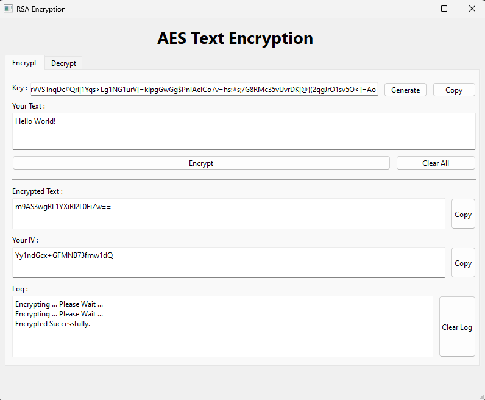

# AES Encryption and Decryption Tool

This software provides a user-friendly interface for encrypting and decrypting text using the Advanced Encryption Standard (AES) algorithm in Cipher Block Chaining (CBC) mode. With a secure key input, users can easily protect their sensitive information and retrieve it when needed.

